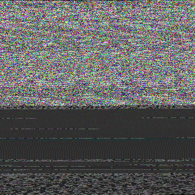

# Web Bundle

* Tool to pack binary files into a PNG image.
* Users can load a `bundle.wp` file and extract its data indexed by the original file's path.
  * A file in the folder `root/img/logo.png` can be accessed by `bundle.read("img/logo.png") == Uint8Array`
  * Helper methods allow users to read the desired data format.
    * `var d = bundle.readJSON("data/file.json") == object`
	* `var s = bundle.readText("data/file.txt") == string`
	* `var img = bundle.readImg("img/logo.jpg") == ImageElement`

## Example Bundle
This PNG contains the following files:  

* xml.dae
* data.json
* portrait.png  



# Why Bundle stuff ?

* Significantly reduce the number of HTTP requests allowing fast page loads
* Text data can be at least 40% compressed
* Browsers decompression routines are native and fast
* Games can greatly benefit of the compression and data packing
* No need to create and manage your own pack data type

## Compression [CLI]
* Install the `wb` tool with `$ npm install web-bundle`, or find it in `tool/wb.js`
* In the command line, run `$ wb encode -o my-bundle.wb foo.json bar.png`
* After running, `foo.json` and `bar.png` will be stored in `my-bundle.png`
* Use `--output` or `-o` to choose the output location for the bundle
* Use `--add` or `a` to add files to an existing bundle instead of creating a new one
* See `wb --help` for more

## Compression [Node.JS]
* Install web-bundle with `npm install --save web-bundle`
```javascript
var wb = require('web-bundle');

var bundle = new wb.Bundle();
bundle.addFile('foo.png', function(err) {
  // some/dir/foo.png has been added to the bundle
  
  bundle.write('bundle.wb', function(err) {
    // Bundle written
  });
});
```

## Decompression [JavaScript, browser]
* Add the scripts `deploy/js/wb.js` or `deploy/js/wb.min.js`  to your page. 
```javascript
var b = new Bundle();
b.load("data/output.wb",function(bundle,progress)
{
	if(progress >= 1.0)
	{
		if(bundle != null)
		{
			bundle.read[Text|JSON|Img|...]("data-id");
		}
	}
},[password]);
```

## Decompression [Haxe]
* Make sure `<script src='js/wb.js'/>` exists in your page.
* Make sure the `web-bundle` library is installed and linked in your project.
  * Use `haxelib` to install the library.
  * `haxelib git web-bundle https://github.com/haxorplatform/web-bundle.git 1.0`
	  
```haxe
import js.Bundle;

var b : Bundle = new Bundle();
b.load("data/output.wb",function(bundle:Bundle,progress:Float)
{
	if(progress >= 1.0)
	{
		if(bundle != null)
		{
			bundle.read[Text|JSON|Img|...]("data-id");
		}
	}
},[password]);
```

## Decompression [Node.JS]
* Install with `$ npm install --save web-bundle`
```javascript
var wb = require('web-bundle');

var bundle = new wb.Bundle();
bundle.load('my-bundle.wb', function(err) {
  // Bundle loaded
  bundle.read('foo.json') // -> Buffer
  bundle.readString('foo.json') // -> string
  bundle.readJSON('foo.json') // -> Object
});
```

## Decompression [CLI]
* Install the `wb` tool with `$ npm install web-bundle`, or find it in `tool/wb.js`
* To see the contents of a bundle, run `$ wb ls my-bundle.wb`
* To extract all files, use `$ wb decode my-bundle.wb`
* Specify an output location with `--output` or `-o`: `$ wb decode my-bundle.wb --output some/dir`
* Extract a single file with `--extract` or `-e`: `$ wb decode my-bundle.wb --extract foo.png`
* See `$ wb --help` for more
